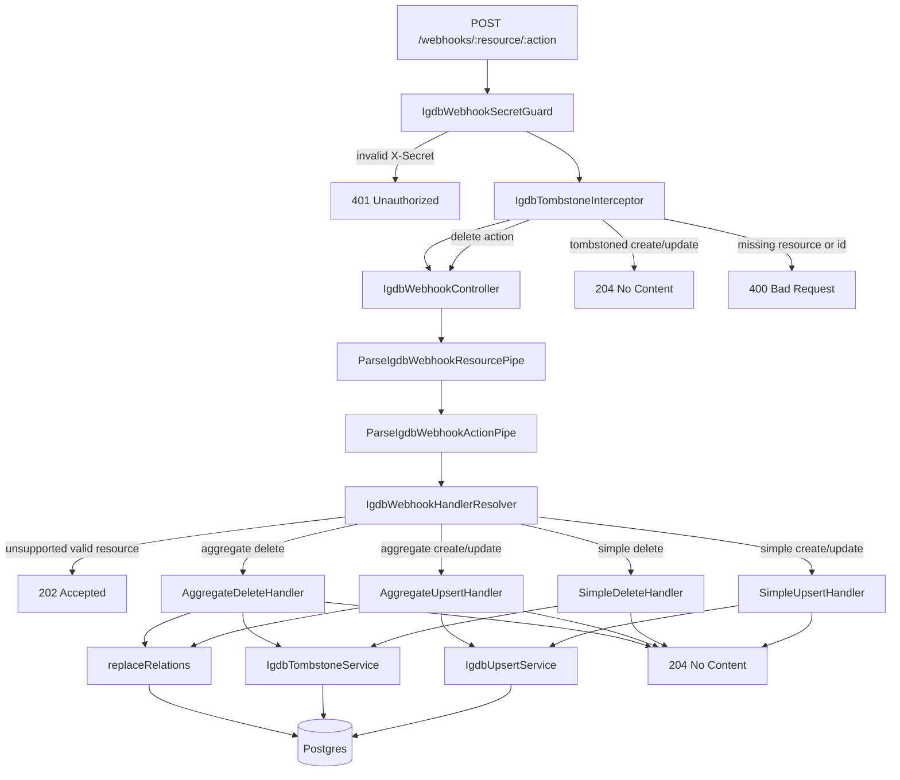

# API Webhook

This app is the write-side ingress for IGDB webhooks.

Its current responsibilities are:

- accept `POST /webhooks/:resource/:action`
- expose admin endpoints to register and manage IGDB webhooks
- reject invalid secrets early
- validate `resource` and `action` route params with custom pipes
- ignore create/update events for tombstoned records
- map IGDB vendor payloads into `@stakload/database` entity shapes
- persist simple resources directly
- persist aggregate resources transactionally with relation replacement
- resolve affected game IDs from Redis dependency sets for cache-affecting resources
- enqueue `game-build-queue` jobs for `worker-builder` cache rebuilds

## Request Flow



## Main Components

### `IgdbWebhookSecretGuard`

- reads `X-Secret`
- compares it to `IGDB_WEBHOOK_SECRET`
- rejects invalid requests before they reach the controller

### `IgdbTombstoneInterceptor`

- runs after auth
- skips tombstone checks for `delete`
- for `create` and `update`, checks whether `(resource, igdbId)` is already tombstoned
- short-circuits with `204` if the record is already dead

### `ParseIgdbWebhookResourcePipe`

- validates that `:resource` is a real IGDB resource
- narrows the controller param to `WebhookResource`

### `ParseIgdbWebhookActionPipe`

- validates that `:action` is one of `create | update | delete`
- narrows the controller param to `WebhookAction`

### `IgdbWebhookController`

- receives validated `resource` and `action` params
- forwards the request body to the resolver
- applies the returned HTTP status code

### `IgdbWebhookHandlerResolver`

- looks up the resource definition
- returns `202` for valid but unsupported resources
- extracts `igdbId` for delete payloads
- chooses one of four handlers:
  - `SimpleUpsertHandler`
  - `SimpleDeleteHandler`
  - `AggregateUpsertHandler`
  - `AggregateDeleteHandler`

## Handler Types

### Simple Upsert

Used for resources that map to a single primary table write.

Examples:

- `genres`
- `platform_types`
- `platforms`
- `screenshots`
- `websites`

Flow:

1. Map the IGDB payload to an entity shape.
2. Upsert through `IgdbUpsertService`.
3. Return `204` if applied or stale-rejected.

### Simple Delete

Used for simple resources that only need:

1. hard-delete the row by `igdbId`
2. record a tombstone

### Aggregate Upsert

Used for resources that require a root row plus relation replacement.

Current aggregate resource:

- `games`

Flow:

1. Start a transaction.
2. Hash the resource name and acquire a Postgres advisory lock on `(resource, igdbId)`.
3. Upsert the root row through `IgdbUpsertService`.
4. If the upsert actually applied, replace join-table rows via the transaction `EntityManager`.
5. Commit and return `204`.

### Aggregate Delete

Used for aggregate resources that need:

1. transaction
2. advisory lock
3. relation cleanup
4. root delete
5. tombstone write

## Persistence Services

### `IgdbUpsertService`

- performs insert/update logic
- supports stale-write rejection for `stale_protected` resources using `sourceUpdatedAt`
- returns whether the write actually applied

### `IgdbTombstoneService`

- reads and writes the app-local `igdb_tombstones` table
- prevents deleted records from being recreated by late webhook delivery

## Resource Definitions

[`src/webhooks/resource-definitions/igdb-resource-definitions.ts`](/c:/Users/Beau/projects/stakload/apps/api-webhook/src/webhooks/resource-definitions/igdb-resource-definitions.ts)
is the registry for supported resources.

Each definition declares:

- the IGDB resource name
- the target entity
- whether the resource is `simple` or `aggregate`
- the mapper to use
- the stale protection mode
- for aggregates, the relation replacement function

Exports of note:

- `SUPPORTED_RESOURCE_DEFINITIONS`
- `RESOURCE_DEFINITION_MAP`

## Mapper Layer

The mapper layer converts `@stakload/igdb-vendor` payloads into `@stakload/database` entity shapes.

Structure:

- one mapper file per payload type
- shared parsing helpers in
  [`src/webhooks/mappers/shared/mapper-utils.ts`](/c:/Users/Beau/projects/stakload/apps/api-webhook/src/webhooks/mappers/shared/mapper-utils.ts)
- relation row builder in
  [`src/webhooks/mappers/build-game-relation-rows.ts`](/c:/Users/Beau/projects/stakload/apps/api-webhook/src/webhooks/mappers/build-game-relation-rows.ts)

Examples:

- `mapGamePayload`
- `mapPlatformPayload`
- `mapWebsitePayload`

## Current Supported Resources

Supported now:

- `games`
- `artworks`
- `collections`
- `companies`
- `company_logos`
- `company_statuses`
- `covers`
- `external_games`
- `external_game_sources`
- `franchises`
- `game_modes`
- `genres`
- `involved_companies`
- `keywords`
- `platforms`
- `platform_families`
- `platform_logos`
- `platform_types`
- `player_perspectives`
- `release_dates`
- `release_date_regions`
- `release_date_statuses`
- `screenshots`
- `themes`
- `websites`
- `website_types`

Valid but unsupported IGDB resources currently return `202 Accepted`.

## Testing

The app currently uses:

- `vitest`
- `@suites/unit` for DI-oriented class tests

Coverage currently exists for:

- guard
- interceptor
- resolver
- controller
- pipes
- tombstone service
- every mapper
- shared mapper utilities
- game relation row builder

## Current Gaps

Not implemented yet:

- replay tooling
- production health/readiness endpoints
- migrations for the webhook app schema
- empirical confirmation of which webhook payloads reliably include `updated_at`

## Admin API

Admin endpoints are now available for webhook management:

- `GET /admin/webhooks`
- `POST /admin/webhooks`
- `DELETE /admin/webhooks/:webhookId`
- `POST /admin/webhooks/:webhookId/test`
- `POST /admin/webhooks/sync`
- `POST /admin/webhooks/purge?confirm=true`

All admin endpoints require:

- `x-secret: <IGDB_WEBHOOK_SECRET>`

The service currently uses a shared-secret model: the same `x-secret` / `IGDB_WEBHOOK_SECRET` protects both inbound webhook delivery and admin operations.

Create requests take this payload:

```json
{
  "resource": "games",
  "action": "update"
}
```

The callback URL is derived automatically as:

```txt
${PUBLIC_WEBHOOK_BASE_URL}/webhooks/:resource/:action
```

The service is stateless for registration and does not auto-reconcile webhooks on startup.

Example admin calls:

```sh
curl http://localhost:3001/admin/webhooks \
  -H "x-secret: local-dev-secret"
```

```sh
curl -X POST http://localhost:3001/admin/webhooks \
  -H "Content-Type: application/json" \
  -H "x-secret: local-dev-secret" \
  -d "{\"resource\":\"games\",\"action\":\"update\"}"
```

```sh
curl -X DELETE http://localhost:3001/admin/webhooks/42 \
  -H "x-secret: local-dev-secret"
```

```sh
curl -X POST http://localhost:3001/admin/webhooks/42/test \
  -H "Content-Type: application/json" \
  -H "x-secret: local-dev-secret" \
  -d "{\"resource\":\"games\",\"entityId\":1337}"
```

```sh
curl -X POST http://localhost:3001/admin/webhooks/sync \
  -H "x-secret: local-dev-secret"
```

```sh
curl -X POST "http://localhost:3001/admin/webhooks/purge?confirm=true" \
  -H "x-secret: local-dev-secret"
```

Purge requests without `confirm=true` are rejected with `400`.

Admin status codes:

- `POST /admin/webhooks` -> `201`
- `POST /admin/webhooks/sync` -> `200` (or `202` when skipped due to lock contention)
- `POST /admin/webhooks/purge?confirm=true` -> `200`

Webhook registration is stateless. Scheduled reconciliation is optional via `IGDB_SCHEDULED_SYNC_ENABLED`.
When enabled, a sync-only cron runs every 30 minutes with a shared advisory lock so it cannot overlap with manual sync calls.
No startup sync is executed automatically.

IGDB deactivates webhooks after repeated failed deliveries, so `PUBLIC_WEBHOOK_BASE_URL` must be publicly reachable.

## Local Docker

For local webhook testing, the repo now includes:

- [`docker-compose.yml`](/c:/Users/Beau/projects/stakload/docker-compose.yml)
- [`apps/api-webhook/Dockerfile`](/c:/Users/Beau/projects/stakload/apps/api-webhook/Dockerfile)

Start the stack:

```sh
docker compose up --build
```

Docker Compose reads variables from the repo-level `.env`. Start from:

```sh
cp .env.example .env
```

That boots:

- `postgres` on `localhost:${POSTGRES_PORT}`
- `redis` on `localhost:${REDIS_PORT}`
- `api-webhook` on `localhost:${API_WEBHOOK_PORT}`
- `worker-builder` for queue-driven Redis cache rebuilds

Required IGDB values in `.env`:

- `IGDB_CLIENT_ID`
- `IGDB_CLIENT_SECRET`
- `IGDB_WEBHOOK_SECRET`
- `IGDB_SCHEDULED_SYNC_ENABLED` (optional, default `false`)

Other local defaults are provided in `.env.example` (`POSTGRES_*`, ports, `DATABASE_SYNCHRONIZE`, `PUBLIC_WEBHOOK_BASE_URL`, etc.).
`DATABASE_SYNCHRONIZE=true` is still intended for local container testing only so the schema exists without migrations.

Example webhook request:

```sh
curl -X POST http://localhost:3001/webhooks/platforms/create \
  -H "Content-Type: application/json" \
  -H "X-Secret: local-dev-secret" \
  -d "{\"id\": 48, \"name\": \"PlayStation 4\", \"slug\": \"playstation4\"}"
```

Example Postgres check:

```sh
docker exec -it stakload-postgres psql -U stakload -d stakload -c "select * from platforms order by igdb_id desc limit 10;"
```
